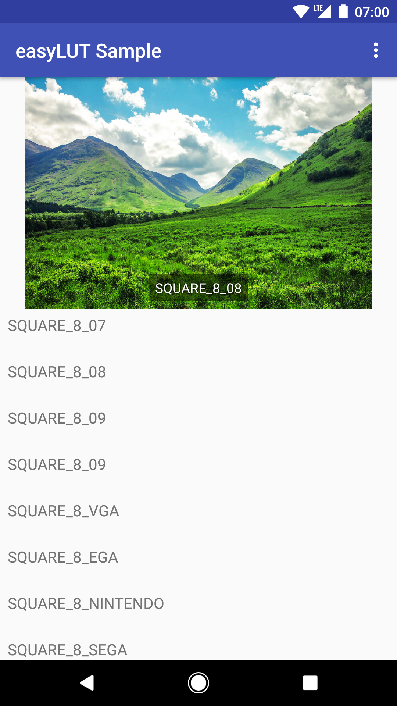

With easyLUT you can apply several types of color look-up table (CLUT) transformations to your Bitmaps and ImageViews easily.

# Dependency

EasyLUT is available on jCenter:

`compile 'hu.don.easylut:easylut:0.4'`

# Usage

This project includes a sample of the library in the `sample` module. The library itself is located in `library`.

Example usage with resource id:

    Filter filter = EasyLUT.fromResourceId()
                           .withResources(resources)
                           .withLutBitmapId(R.drawable.filter_lut_01)
                           .createFilter();
    Bitmap filteredBitmap = filter.apply(originalBitmap);

Example usage with bitmap:

    Filter filter = EasyLUT.fromBitmap()
                           .withBitmap(lutBitmap) //lutBitmap is created by you before
                           .createFilter()
    Bitmap filteredBitmap = filter.apply(originalBitmap);

**Important**: Put your LUT images into the drawable-nodpi folder, so they won't get resized by the system.

When calling with resources it won't load the bitmap into memory until using the bitmap, and the LUT's bitmap won't stay in memory after usage. However it will reload the bitmap every time you use the LUT filter.

When calling with bitmap, the LUTFilter object will have a reference to the bitmap object, but it won't load the bitmap every time you use it.

It's highly recommended to explicitly specify the color axes using `withColorAxes()` to avoid unexpected results. CLUTs are typically `CoordinateToColor.Type.RGB_TO_XYZ`.

Full usage with resource id:

    EasyLUT.fromResourceId()
           .withResources(resources)
           .withLutBitmapId(R.drawable.filter_lut_01)
           .withColorAxes(CoordinateToColor.Type.RGB_TO_XYZ)           //default is GUESS_AXES
           .withStrategy(BitmapStrategy.Type.APPLY_ON_ORIGINAL_BITMAP) //default is CREATING_NEW_BITMAP
           .withAlignmentMode(LutAlignment.Mode.HALD)                  //default is SQUARE
           .createFilter();

# Supported image types

Compatibility tested for the following LUT image types:

## Square 64x64x64 LUT

- 2D image is 512×512
 - Conventional RGB dimensions: red on X-axis, green on Y-axis, blue on Z-axis

## Hald 64x64x64 LUT

 - 2D image is 512×512

## One-lined LUTs

- One-line LUT, where Z-axis continues horizontally instead of wrapping to form a square

## Alternative RGB dimensions

 - Inverted RGB dimensions: blue on X-axis, red on Y-axis, green on Z-axis

- Inverted RGB dimensions: blue on X-axis, green on Y-axis, red on Z-axis

## Other variants

The RGB dimensions are now guessed by the library, assuming that the RGB dimensions correspond with the LUT cube's XYZ axes such that the maximum value exists in the farthest coordinate.

If you come across any other LUT types which is not handled well by the library please create a ticket.

## Future improvement possibilities

 - Direct usage with ImageView. Problem can be that the original bitmap will be lost after applying filter.
 - Enable a from file and to file option. 
 - Processing large images without having OutOfMemoryError.
